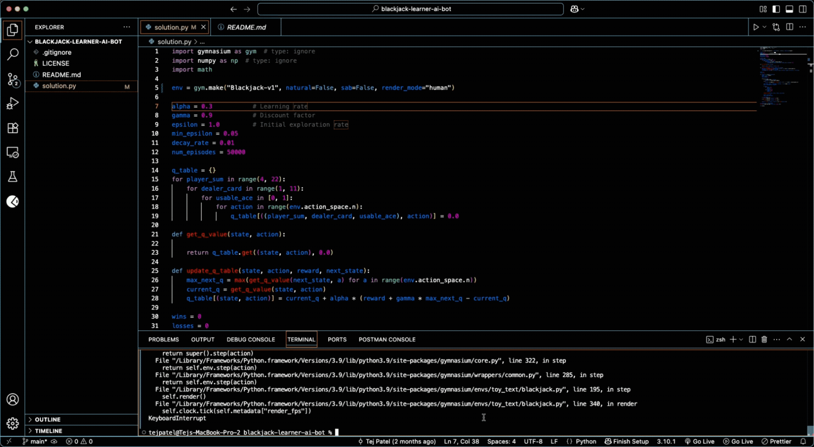
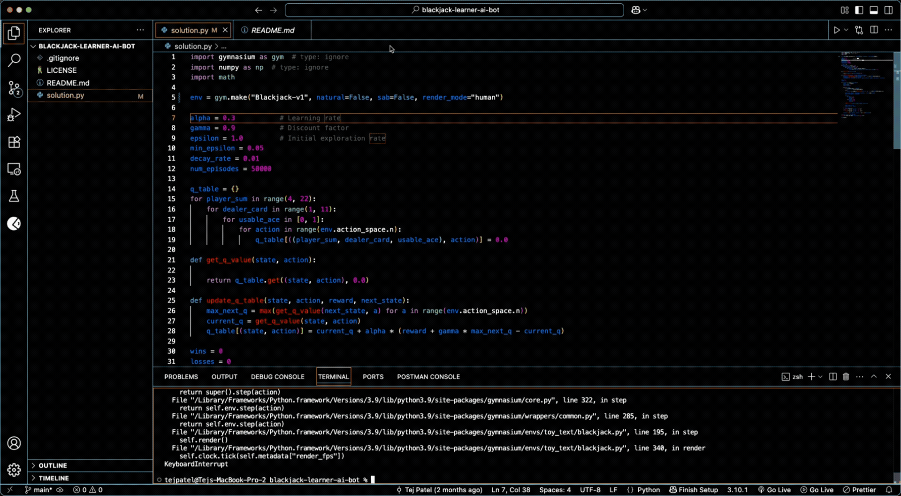

# ♠️ Reinforcement Learning: Blackjack with Q-Learning

This project demonstrates my implementation of a **model-free reinforcement learning agent** that learns to play Blackjack using the classic **Q-learning algorithm**.

Built as part of my Artificial Intelligence course at Penn State, I treated this project as a hands-on opportunity to apply and understand key RL concepts like action-value updates, exploration vs. exploitation, and policy improvement — all within the uncertainty and thrill of the Blackjack environment.

---

## 🎯 Objective

The agent’s goal is to beat the dealer by learning an optimal policy that maximizes reward over time. It does this by:

-   Exploring the state-action space using an **ε-greedy strategy**
-   Updating its Q-values using the **Bellman equation**
-   Decaying its exploration rate as training progresses

---

## 🧠 Techniques Used

-   **Q-learning (model-free)**
-   Epsilon decay scheduling
-   Custom reward shaping to encourage strategic behavior
-   State space encoding: `(player sum, dealer’s visible card, usable ace)`

---

## 🛠 Tech Stack

-   Python 3.9
-   [Gymnasium](https://gymnasium.farama.org/) (Blackjack-v1 environment)
-   NumPy

---

## 📸 Demo

### 👁️‍🗨️ GUI-Based Blackjack Gameplay

The agent plays the game with full render enabled — ideal for visualizing every decision made:


### ⚡ Fast Terminal Training (No GUI)

Watch how the model trains and logs results rapidly in the terminal for speed and performance evaluation:


---

## 🚀 How to Run

1. Install the environment:

    ```bash
    pip install gymnasium
    ```

2. Run the training script:

    ```bash
    python3 solution.py
    ```

---

## 📊 Results

After training, the agent consistently achieves a **win rate of ~40–45%**, which is competitive given the probabilistic nature of Blackjack and the absence of card counting.

The model’s performance improves visibly over time as `ε` decays, favoring learned strategies over random actions.

---

## 💭 What I Learned

-   Implementing RL from scratch builds real intuition about how agents _learn through interaction_
-   Simple changes in **reward structure** and **exploration settings** can dramatically affect learning curves
-   Blackjack, despite its simplicity, offers a great sandbox for building core RL skills

This project laid a strong foundation for tackling more complex environments like Frozen Lake, CartPole, and beyond.

---

## 🧩 Possible Improvements

-   Implement **Double Q-learning** to reduce overestimation bias
-   Train multiple agents and ensemble their strategies
-   Visualize policy evolution over episodes
-   Extend state space to include card history (mimic basic card counting)

---

## 🧠 Let’s Connect!

**Tej Jaideep Patel**  
B.S. Computer Engineering  
📍 Penn State University  
✉️ tejpatelce@gmail.com  
📞 814-826-5544

---
